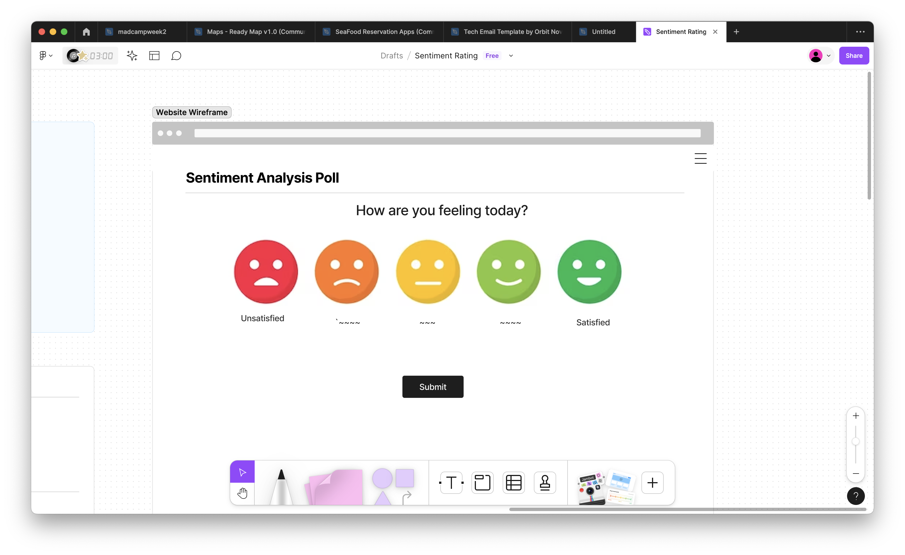

# Development Notes for Task 1: Sentiment Rating Widget

### Group Members who Worked on this Task:
- Sonya
- Kainoa
- Sahana
- Andrew

In this file, we have outlined our development process from start to finish. We have also included notes about the usage of AI in our project. At the end, we have a description about our finished product. 

### Initial Ideas:
- A question at the top asking how the user is feeling and a prompt telling them to choose an option
- 5 different smiley faces placed in a row representing different emotions and colored accordingly
- Indicator for the user's selection
- Have the button trigger a message depending on the user's selection. For example, celebratory for happy, or ‘hope you feel better’ for sad
- Add functions in JavaScript for animation
  

### Development Process:
- Before we started coding, we developed diagrams show what we wanted our user interface to look like. We used tools in Figma to create this initial diagram
  
- Started off with basic HTML code containing the title message and clickable buttons
- Generated images for the face icons using AI
- Incorporated CSS to style the text and to add colors, borders and a shadow around the icons
- Incorporated JavaScript functions to add a custom message upon clicking the submit button

### Testing Process:
-  After testing the different ways in which the user could use the widget, we added some finishing touches
-  Discovered that the 'you selected...' messages were stacking up, so we modified our code so that it would be replaced with another message once the next submission was made
-  Added a message prompting the user to make a selection if they tried to submit without clicking on an icon
-  Added code to modify the width and size of the buttons based on the orientation of the user's device - for example, if they are using the widget on a phone, the page will have different dimensions. If their phone is rotated, a message will be displayed asking them to rotate it back to portrait mode
-  Added a backend counter using JavaScript to count how many submissions the users made

### Incorporating AI
- Used AI to develop an initial base of code to build from and this worked out well for the skeleton HTML code
- Asked GPT-4 to generate images to use for the icons and this was a very slow and frustrating process as it took many generations from two people to generate usable images that looked similar to each other. During some of the requests, it generated images that looked completely different from each other or did not provide the colors/features that we asked it to
- Asked for specific functions in JavaScript, for example "could you give the code for adding a custom message"
- Some of the code it generated was usable but had a few minor bugs, so we had to fix these ourselves by looking up HTML/CSS/JS documentation
- Overall we found that we had the most success with AI when we asked it for small chunks of code (one function at a time) and were very specific. It did not work as well with vague/long instructions
- For now, we will keep it in our toolkit for generating code. For generating images, other methods may work better

## Final Product

Our final product is a 'Sentiment Analysis Poll' with a prompt asking the user how they are feeling. 5 icons placed in a row indicate different emotions - 'angry', 'upset', 'neutral', 'happy', and 'overjoyed'. The icon that the user hovers and clicks on will be highlighted, and then they will need to click the 'submit' button. If they try to submit without making a selection, a message prompting them to click on one of the icons will be shown. Once they make their selection, a custom message responding to their selection will be displayed. They can make as many selections and submit as many times as they wish, and each time the message will be updated and a backend counter will be incremented. The orientation of this widget will be slightly modified to fit the orientation and size of the device used by the user. 
